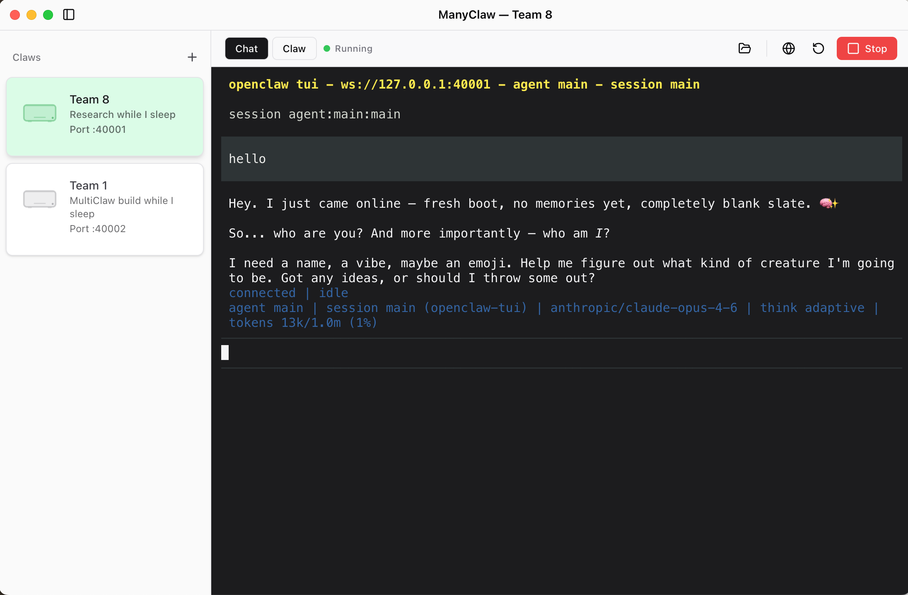

# ManyClaw

**Run multiple OpenClaw instances on one machine.**

ManyClaw is a native macOS app that manages multiple isolated OpenClaw instances — each with its own memory, sessions, workspace, and config. No terminal, no `--profile` flags, no port conflicts.



---

## The problem

You're using OpenClaw and you want more than one. A dev instance and a production instance. A personal one and a work one. The common workaround in the community is to buy another Mac Mini — one per instance, fully separate.

You don't need another Mac Mini. OpenClaw already supports isolated instances through `--profile` flags, but managing them means living in the terminal. ManyClaw puts all of that in one window — create, start, stop, and delete instances on a single machine, no terminal required.

---

## What it does

- **Named instances** — create, start, stop, and restart instances from a sidebar
- **Real isolation** — each instance is its own OpenClaw profile with independent memory, sessions, and config
- **Clone an instance** — duplicate a working setup in one click to experiment without risk
- **Live console + TUI** — see output per instance, switch to the full interactive TUI when you need it
- **Open in browser** — jump straight to the OpenClaw dashboard for any instance
- **Automatic port management** — no collisions, no manual assignment

---

## How it works

OpenClaw has a built-in `--profile` flag that creates fully isolated instances — separate memory, sessions, workspace, and port. Most people don't know it exists.

ManyClaw is a GUI that manages these profiles for you:

1. **Create an instance** — give it a name (e.g. "dev", "production", "experiments")
2. **Press Start** — ManyClaw launches it as an isolated OpenClaw profile in the background
3. **Switch between them** — click any instance in the sidebar to see its console, open its TUI, or open it in the browser

Each instance runs independently. Your dev instance and your production instance don't share context, memory, or state.

---

## Who it's for

Anyone running more than one OpenClaw instance. Developers keeping dev and production separate. Researchers with isolated projects. Teams that need clean boundaries between workloads.

---

## Requirements

- macOS (Apple Silicon)
- [OpenClaw](https://openclaw.ai) installed

---

## Install

Download the latest DMG from [manyclaw.app](https://manyclaw.app), open it, drag ManyClaw to Applications.

---

## Build from source

```bash
cd apps/desktop
pnpm install
pnpm dev         # development
pnpm dist:mac    # production DMG
```

For a signed and notarized build:

```bash
APPLE_ID="your@email.com" \
APPLE_APP_SPECIFIC_PASSWORD="xxxx-xxxx-xxxx-xxxx" \
APPLE_TEAM_ID="YOURTEAMID" \
pnpm dist:mac
```

---

## Repo structure

```
apps/
  desktop/        Electron app (TypeScript + React)
    src/
      main/       Main process (Electron, IPC, instance lifecycle)
      renderer/   UI (React, Tailwind, shadcn/ui)
      preload/    Preload bridge
      instances/  OpenClaw process management
      shared/     Shared IPC types
content/
  blog/           Blog posts (markdown)
  docs/           Documentation (markdown)
product/
  brief.md        Product overview
  notes/          Architecture, UX spec, technical learnings
  decisions/      Architecture decision records
website/          Marketing site (React Router + Tailwind)
```

---

## Tech stack

- Electron + React + TypeScript + Vite
- node-pty + xterm.js for the TUI
- shadcn/ui + Tailwind CSS
- electron-builder for distribution

---

## License

GPL-3.0 — see [LICENSE](LICENSE)

Built by [Productvibe](https://productvibe.io)
